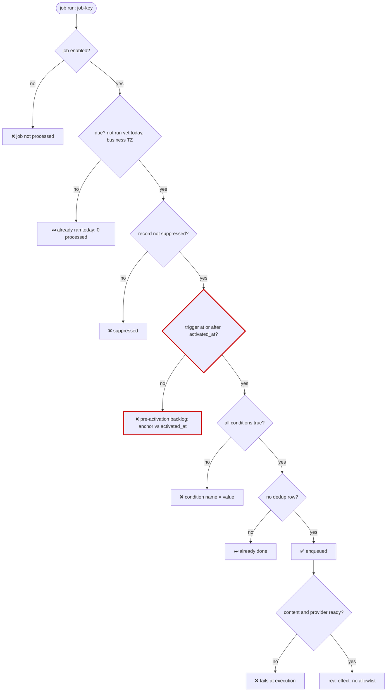
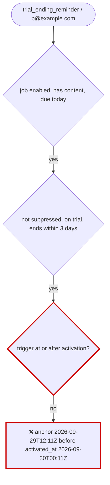

# Pipeline state debug reference

## Gate catalog

Look for each of these kinds of gate in the engine. Most "it didn't run" answers trace back to a trap in the last column.

| Gate kind | Typical predicate | Silent-failure trap |
| --- | --- | --- |
| Enabled | `job.enabled = true` | Disabled jobs are often filtered out of the engine's query, so they never appear in logs |
| Due / schedule | not run yet today; cron expression | "Today" is computed in the business time zone, not UTC |
| Content / config | template compiled; provider keys set | When the provider isn't configured, the job silently no-ops or leaves rows on hold |
| Suppression | email present, not banned, not unsubscribed, not bounced | Each suppression list lives in a different table |
| Conditions | plan, state, or count predicates | Counts over child rows that filter by status |
| Activation anchor | `trigger_ts >= activated_at` | The anchor resets on every enable, so the backlog is excluded |
| Window clamp | `greatest(start, end - N days)` | Without the clamp, a record enters its window before it started |
| Hold / maturity | `hold_until <= now()` | Hold length comes from a constant that drifts |
| Dedup / idempotency | unique dedupe key or ledger row | A previous test run's row blocks the next run |
| Claim / concurrency | `FOR UPDATE SKIP LOCKED`, `status IN (...)` | Rows stay stuck in `processing` until a stale-claim timeout |
| Retry cap | `attempts < max` | Failed rows stop retrying without any error |
| Execution | provider call succeeds | Sandbox keys and live keys behave differently |

## Adapting the template

`scripts/diagnose-template.ts` has three commands. All of them print the DB host first:

| Command | Effect | Writes |
| --- | --- | --- |
| `diagnose <job> <record> [--activated-at <iso\|now>] [--mermaid]` | Evaluates every gate for one record. Prints ✅/❌ with values, the first blocking gate, and optionally a mermaid path | no |
| `audience <job> [--activated-at <iso\|now>] [--limit n]` | ANDs every SQL gate into one query and lists the matching records. Reports failing job-level gates as notes, so a disabled job can still be previewed | no |
| `reset <job> <record> [--apply --confirm-host <host>]` | Clears the last-run marker and the record's dedup row in one transaction. Without `--apply` it prints the planned writes only | yes |

To adapt it:

1. Fill in the `KEEP IN SYNC` header with the engine files you read in the gate-mapping step.
2. Set the configuration block: the DB env var, the env files, `PROD_HOST_PATTERNS`, the business time zone, the constants module, and the table names.
3. Replace `loadThresholds()` so it reads every number from the engine's source.
4. Rewrite `JOB_GATES` (JS checks on the job row) and `recordGates()` (SQL over alias `r`) in engine order. The `diagnose` and `audience` commands both build on the same `sqlGate` predicates, so the two can't drift apart.
5. Point `reset` at exactly the dedup key the engine checks.
6. Run `diagnose` on one record you already know passes and one you know fails. Only then trust its answer on the record in question.

If the engine's predicates live in importable, side-effect-free modules, import them instead of copying the SQL.

## Mermaid template

Keep the path up to the blocking gate, mark that gate, put its concrete values on the blocked node, and drop every branch after it.



Under the diagram, add a gate table:

| Gate | Concrete value | Pass |
| --- | --- | --- |
| `after_activation` | anchor `2026-09-29T12:11Z`, activated_at `2026-09-30T00:11Z` | ❌ |

## Fixture driver pattern

To reproduce cases, write one CLI per pipeline. Keep it in a git-ignored directory unless the team wants it committed. Every record argument accepts either an id or an email.

| Command | Effect | Writes |
| --- | --- | --- |
| `inspect <record>` | The record's full pipeline state: its row, child rows, ledger and dedup rows, and both directions of any relationship (inviter and invitee). This is the default when only a record is given | no |
| `list [search]` | Find records to use as counterparts | no |
| `set-state <record> <state>` | Move a row to a named status, validated against the enum. Use the engine's guarded transition (`UPDATE ... WHERE status = '<expected>'`) | yes |
| `adjust <job> <record>` | Shift thresholds on existing rows until the record matches. Prints ADJUSTABLE and NEEDS ADMIN lists (see below) | yes |
| `mature <record>` | Move hold or delay timestamps into the past so the job treats the row as due | yes |
| `simulate-provider <record> <outcome>` | Set the state a provider callback would set (`sent`, `failed`), with `DEBUG-` prefixed provider ids and URLs | yes |
| `reset <record>` | Delete the rows the pipeline created for this record so the case can run again. Keep identity rows such as the user and their codes | yes |

Rules:

- **Pipeline rows versus domain entities.** A fixture may write rows the pipeline itself owns (its queue, ledger, dedup, and status rows) to simulate an engine step. It must never fabricate domain entities that the product creates through user action, such as subscriptions, orders, uploaded files, or completed milestones. Those are NEEDS ADMIN.
- Print the DB host first. Writes require `--apply` and host confirmation, and run in one transaction.
- Read amounts, durations, and caps from the engine's constants, and print where each one came from.
- Make inserts idempotent with `ON CONFLICT (<dedupe key>) DO NOTHING`. Catch unique violations (`23505`) and print "already exists; run reset first" instead of crashing.
- Before `reset`, check the foreign keys' `ON DELETE` behavior and print what will cascade.
- If the provider isn't configured in dev and the job no-ops, use `simulate-provider` rather than running the job.

### `adjust` output

```text
Match "trial_ending_reminder" for user@example.com  (mode: DRY PREVIEW)
ADJUSTABLE (threshold updates on existing rows):
  accounts.trial_ends_at -> now() + interval '2 days'
NEEDS ADMIN (missing entity; create it in the UI, then re-run):
  no trial on this account -> start a trial for user@example.com in the app
(dry preview: re-run with --apply --confirm-host <host>)
```

- Put adjusted timestamps a small margin past the boundary, for example N days plus 1 hour, and after the activation timestamp. Then both the condition and the activation gate pass.
- When a predicate aggregates over several rows (`min()`, `max()`, `exists`), adjust every row that takes part, not just the latest. An untouched older row can still decide the result.

## Triggering a job locally

```bash
SECRET=$(grep -E '^CRON_SECRET=' .env | cut -d= -f2- | tr -d "'\"") && \
  curl -s -H "Authorization: Bearer $SECRET" http://localhost:3000/<job-route> --max-time 60; echo
```

Swap in the repo's own secret name, route, and port. Expect a JSON summary (enqueued, sent, failed, skipped). If the dev server was started before the engine changed, restart it (with `env -u DATABASE_URL`) first.

## Gotchas

- **"relation does not exist"**: the feature's migration may not have been applied to this database. Migrators that track progress by sequence or timestamp can silently skip a migration numbered below the latest applied one, which is common on shared dev databases after a branch merge. Check the migration ledger.
- **Serverless HTTP drivers** (HTTP-based Postgres clients, data-API SDKs) often fail in scripts run outside the app and lack interactive transactions. Use `pg` or `postgres` over TCP. An `sslmode` deprecation warning from `pg` is harmless.
- **Importing app modules** can pull in env validation, path aliases, or framework-only imports (`server-only`), and then fail outside the app. Import only side-effect-free constants modules. Otherwise, copy the SQL and list its source in `KEEP IN SYNC`.
- **Env precedence**: Bun auto-loads `.env` files into `process.env`, but shell variables win, which is why `env -u` matters. Know whether `.env` or `.env.local` holds the DB URL.
- **Disabled jobs** may never reach the engine's query. A dry run that also filters on `enabled` can't preview the job you are about to enable.
- **Time zones**: compute "today" the way the engine does, and compare instants (`timestamptz`), not local date strings.

## Worked example: trial-ending reminder

The domain is invented. A job `trial_ending_reminder` emails each trial account once, `TRIAL_REMINDER_DAYS_BEFORE` days before the trial ends. The constants file sets that to 3, and the script imports it. The job was enabled two days ago, which stamped `activated_at`.

**Question:** why didn't `b@example.com` get the reminder?

**Gates, in engine order:** `job_enabled`, `job_has_content`, `job_due_today`, `not_suppressed`, `on_trial`, `in_window` (trial ends within 3 days), `after_activation` (anchor `greatest(trial_started_at, trial_ends_at - 3 days) >= activated_at`), and `not_already_sent` (no `once` row in `job_sends`).

**Diagnose:**

```text
DB host: localhost:5432  database: app
activation used: 2026-09-30T00:11:06Z   thresholds: {"reminderDaysBefore":3}
✅ in_window          trial ends within 3 days  | trial_ends_at=2026-10-02T12:11:06Z
❌ after_activation   trigger fired at/after job activation  | anchor=2026-09-29T12:11:06Z  -> pre-activation backlog is excluded by design
✅ not_already_sent   no 'once' dedup row  | send_rows=0
>>> BLOCKED BY: after_activation
```

**Answer:**



The account's reminder window opened (trial end minus 3 days) about 12 hours before the job was enabled. The engine deliberately skips that backlog, so this is expected behavior, not a bug. The options:

1. Accept it: accounts whose window opens after activation will get the email.
2. Test in dev: `adjust` moves `trial_ends_at` on the existing account so the anchor lands after activation. This is a write and needs consent.
3. Don't re-enable the job to "fix" it. Re-enabling restamps `activated_at = now` and excludes even more accounts. `audience --activated-at now` shows the effect: 0 accounts.

**A second case**: `c@example.com` is blocked by `not_already_sent` with `send_rows=1`. It already got the email. To re-test, `reset --apply --confirm-host <host>` deletes that one dedup row. It also clears `last_run_at` for the whole job, so the next run processes every due account, not only `c`. Ask before running it, and run `audience` first.
